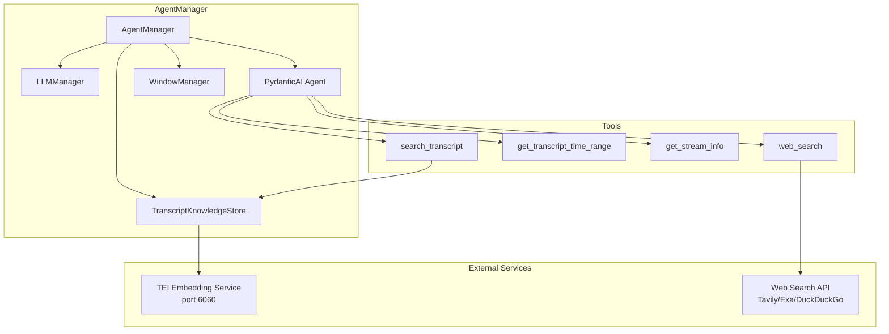
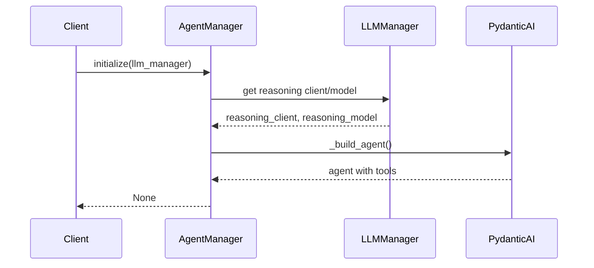
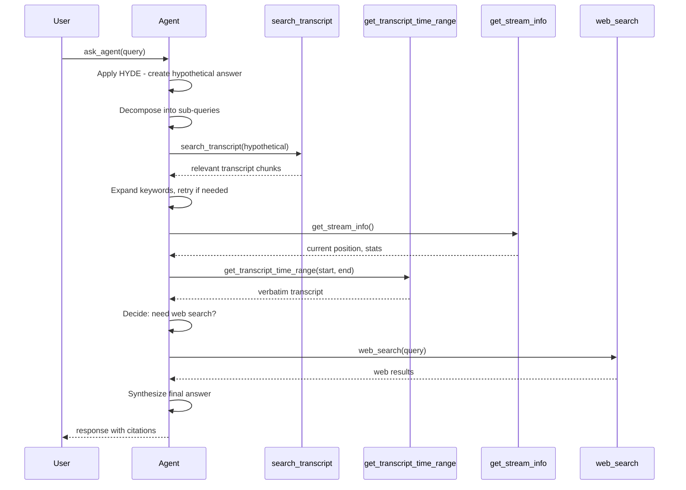
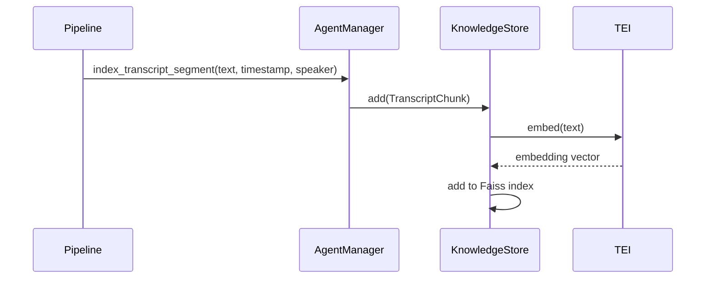

# AgentManager Documentation

## Overview

The [`AgentManager`](src/summary/agent_manager.py:308) provides an autonomous PydanticAI agent with semantic search over indexed transcript chunks and live web search capabilities. It extends the LLMManager to add autonomous question-answering functionality over video transcripts.

## Architecture



## Core Components

### 1. TranscriptKnowledgeStore

The knowledge store provides in-memory vector storage using Faiss for semantic search over transcript chunks.

**Location**: [`TranscriptKnowledgeStore`](src/summary/agent_manager.py:84)

**Key Features**:
- Dense vector storage using Faiss IndexFlatL2
- Lazy index initialization (created on first insert)
- Thread-safe async operations with asyncio.Lock
- Configurable embedding model and TEI service endpoint
- Speaker remapping support for handling speaker merges

**Configuration**:

| Environment Variable | Default | Description |
|---------------------|---------|-------------|
| `EMBEDDING_BASE_URL` | `http://byoc-transcription-tei-embeddings:6060/v1` | TEI embedding service URL |
| `EMBEDDING_API_KEY` | `dummy` | API key for TEI service |
| `EMBEDDING_MODEL` | `BAAI/bge-small-en-v1.5` | Embedding model name |

**Public API**:

| Method | Description |
|--------|-------------|
| [`add(chunk: TranscriptChunk)`](src/summary/agent_manager.py:123) | Embed and store a transcript chunk |
| [`search(query: str, top_k: int)`](src/summary/agent_manager.py:136) | Search for relevant chunks (default top_k=15) |
| [`remap_speaker(old_speaker: str, new_speaker: str)`](src/summary/agent_manager.py:150) | Remap all chunks with old_speaker to new_speaker |
| [`remap_speakers(merges: List[Dict[str, str]])`](src/summary/agent_manager.py:169) | Apply multiple speaker merges |
| [`reset()`](src/summary/agent_manager.py:186) | Clear all stored vectors |
| [`size`](src/summary/agent_manager.py:194) | Property returning number of stored chunks |

### 2. TranscriptChunk Dataclass

```python
@dataclass
class TranscriptChunk:
    text: str                           # The transcript text
    timestamp: Optional[float] = None  # Seconds from stream start
    duration: Optional[float] = None  # Duration of this chunk
    speaker: Optional[str] = None     # Speaker identifier
    window_id: Optional[int] = None   # Window identifier
```

### 3. Web Search Priority

The system tries search providers in order of priority:

1. **Tavily** - Requires `TAVILY_API_KEY`
2. **Exa** - Requires `EXA_API_KEY`  
3. **DuckDuckGo** - Fallback, no key required

### 4. WindowManager Integration

The AgentManager integrates with [`WindowManager`](src/summary/window_manager.py) to provide time-range based transcript retrieval. This is set via [`set_window_manager()`](src/summary/agent_manager.py:373):

```python
agent_manager.set_window_manager(window_manager)
```

This enables the `get_transcript_time_range` tool to access transcription windows for time-bounded queries.

## The Agent Loop

### Initialization Flow



### Agent Construction

The PydanticAI agent is built lazily in [`_build_agent()`](src/summary/agent_manager.py:464):

1. Gets the reasoning model name from LLMManager
2. Creates an OpenAIProvider with reasoning endpoint
3. Constructs an OpenAIModel instance
4. Creates an Agent with comprehensive system prompt
5. Registers four tools:
   - `search_transcript` - Semantic search over indexed transcript
   - `get_transcript_time_range` - Time-bounded transcript retrieval
   - `get_stream_info` - Current stream position and statistics
   - `web_search` - Live web search

### System Prompt Strategy

The agent uses a sophisticated search strategy with four key components:

#### 1. HYDE (Hypothetical Document Embedding)
Before calling `search_transcript`, the agent composes a short hypothetical transcript passage (1-3 sentences) that would directly answer the user's question. This hypothetical passage is used as the search query since spoken text retrieves spoken text more accurately than formal questions.

#### 2. Query Decomposition
If the question has multiple parts or sub-topics, the agent splits it into separate sub-queries and issues a distinct `search_transcript` call for each one, then synthesizes the results.

#### 3. Keyword Expansion
For each sub-query, the agent broadens coverage by including synonyms, alternative phrasings, speaker names, entity names, and domain terminology that might appear in spoken transcript text.

#### 4. Temporal Queries
When the user asks about a specific time period, the agent uses `get_transcript_time_range` to retrieve complete verbatim transcript for that range. Time references are resolved as:
- **Relative**: "last 5 minutes" → current position - 300s to current
- **Absolute**: "at 2:30" → 150s; "between 1:00 and 3:00" → 60-180s
- **Context-based**: "beginning" → 0-10%; "end" → 90-100%; "middle" → 40-60%
- **Event-based**: "when X happened" → search first to locate timestamp, then get surrounding context

### Tool Selection Guide

| Tool | Use Case |
|------|----------|
| `get_transcript_time_range` | User asks about a time period → complete verbatim text, ideal for summarization |
| `search_transcript` | User asks about a topic/event → semantic similarity search |
| `get_stream_info` | Resolving relative time references ("last X minutes") |
| `web_search` | Supplement with external context when transcript is thin |

### The Autonomous Agent Loop



The agent loop works as follows:

1. **Query Reception**: [`ask_agent(query)`](src/summary/agent_manager.py:740) receives a natural language question
2. **HYDE Application**: Creates hypothetical answer passage for better retrieval
3. **Query Decomposition**: Splits complex questions into sub-queries
4. **Tool Selection**: The PydanticAI agent autonomously decides whether to call:
   - `search_transcript` - To find relevant video transcript segments
   - `get_transcript_time_range` - For time-bounded queries
   - `get_stream_info` - To resolve relative time references
   - `web_search` - To fetch up-to-date information from the internet
5. **Result Synthesis**: The agent synthesizes a final answer citing sources and timestamps

### Tool Definitions

#### get_stream_info

```python
@agent.tool_plain
async def get_stream_info() -> str:
    """Return current stream position and indexing statistics."""
```

**Returns**: Current stream position and statistics:
```
Current stream position : 1234.5s (20:34)
Total indexed chunks    : 150
Total indexed duration  : 1234.5s (20:34)
Average chunk duration  : 8.23s
```

#### get_transcript_time_range

```python
@agent.tool_plain
async def get_transcript_time_range(start_time: float, end_time: float) -> str:
    """Retrieve the complete verbatim deduplicated transcript for a time range."""
```

**Parameters**:
- `start_time`: Start of the range in seconds from stream start
- `end_time`: End of the range in seconds from stream start

**Returns**: Formatted transcript with timestamps:
```
[Transcript 05:00 to 10:00 — 3 transcription window(s)]

[05:00 – 05:30]
(transcript text from this window)
---
[05:30 – 06:00]
(transcript text from this window)
---
```

#### search_transcript

```python
@agent.tool_plain
async def search_transcript(query: str) -> str:
    """Search the video transcript for content relevant to *query*."""
```

**Returns**: Formatted transcript segments with timestamps and speakers:
```
[3 transcript segment(s) — this is the complete relevant content from the transcript]

[123.4s] (Speaker A) This is the relevant content...
---
[456.7s] (Speaker B) Additional relevant segment...
```

#### web_search

```python
@agent.tool_plain
async def web_search(query: str) -> str:
    """Search the web for up-to-date information about *query*."""
```

**Returns**: Formatted web search results with titles, URLs, and content snippets.

## Integration with SummaryClient

The [`SummaryClient`](src/summary/summary_client.py) uses AgentManager as follows:

1. **Initialization**: Creates an AgentManager instance and calls `initialize(llm_manager)`
2. **WindowManager Integration**: Sets WindowManager via `set_window_manager()` for time-range queries
3. **Transcript Indexing**: When windows are finalized, calls [`index_transcript_segment()`](src/summary/agent_manager.py:391) to embed and store content
4. **Speaker Updates**: Applies speaker merges via `remap_speakers()` when diarization updates occur
5. **Agent Queries**: Exposes [`ask_agent()`](src/summary/summary_client.py) method for UI/consumer use

### Indexing Flow



### Result Callback

The AgentManager supports a `result_callback` for pushing status updates to the UI:

```python
async def status_callback(payload: Dict[str, Any]) -> None:
    # payload example:
    # {
    #     "type": "agent_status",
    #     "tool": "search_transcript",
    #     "display_text": "searching transcript",
    #     "timestamp_utc": "2024-01-15T10:30:00Z"
    # }

agent_manager = AgentManager(result_callback=status_callback)
```

## Stream Position Tracking

The AgentManager tracks stream position as content is indexed:

- `_current_stream_ts`: Latest end-of-chunk timestamp seen
- `_total_chunks`: Total number of chunks indexed
- `_total_indexed_duration`: Sum of all chunk durations

This information is dynamically injected into the system prompt and available via `get_stream_info()`.

## Usage Example

```python
# Initialize
agent_manager = AgentManager(
    embedding_base_url="http://tei:6060/v1",
    embedding_api_key="dummy",
    embedding_model="BAAI/bge-small-en-v1.5",
)
await agent_manager.initialize(llm_manager)

# Set WindowManager for time-range queries
agent_manager.set_window_manager(window_manager)

# Index transcript segments (called by pipeline)
await agent_manager.index_transcript_segment(
    text="The meeting discussed Q4 results",
    timestamp=120.5,
    duration=10.0,
    speaker="Alice",
    window_id=1
)

# Apply speaker merges (when diarization updates)
agent_manager.remap_speakers([
    {"source": "speaker_1", "target": "speaker_0"}
])

# Query the agent
response = await agent_manager.ask_agent(
    "What were the main topics discussed in the meeting?"
)
print(response["response"])

# Reset when stream ends
agent_manager.reset_knowledge_store()
```

## Reset Behavior

When a stream ends, call [`reset_knowledge_store()`](src/summary/agent_manager.py:428) to clear all indexed vectors:

```python
agent_manager.reset_knowledge_store()
```

This clears:
- Faiss index and chunk list
- Stream position tracking (_current_stream_ts, _total_chunks, _total_indexed_duration)
- Speaker remapping state

## Error Handling

| Error | Handling |
|-------|----------|
| Uninitialized Agent | Calling `ask_agent()` before `initialize()` raises `RuntimeError` |
| Missing Reasoning Model | Agent build is skipped with a warning if reasoning model is not set |
| Embedding Failures | Logged as exceptions; indexing continues without the failed chunk |
| Web Search Failures | Returns error message with details; doesn't crash the agent loop |
| No Transcript Content | Returns "No transcript content has been spoken yet..." |
| Time Range No Content | Returns message noting stream position and missing content |

## Environment Variables

| Variable | Required | Default | Description |
|----------|----------|---------|-------------|
| `EMBEDDING_BASE_URL` | No | `http://byoc-transcription-tei-embeddings:6060/v1` | TEI embedding service URL |
| `EMBEDDING_API_KEY` | No | `dummy` | API key for TEI service |
| `EMBEDDING_MODEL` | No | `BAAI/bge-small-en-v1.5` | Embedding model name |
| `TAVILY_API_KEY` | No | - | Tavily API key for web search |
| `EXA_API_KEY` | No | - | Exa API key for web search |